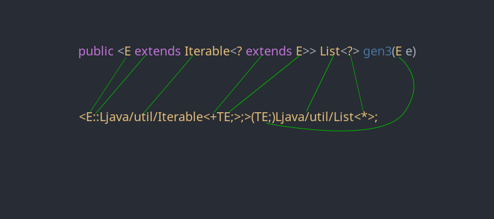

# Introdução

Neste capitulo irei explicar sobre os tipos, os descritores e os modificadores.

# Modificadores

Os modificadores funcionam de uma forma bem especial na JVM, muitos deles tem códigos iguais porém significam coisas diferentes, isto depende de onde estão aplicados, exemplo, o modificador `0x0040`, quando presente em uma field, significa `volatile`, quando presente em um método, significa `bridge`.

------------------------------------------------------------------------------

| Modificador      | Hex    | Elementos                         | Efeito                                                             |
|:-----------------|:-------|:---------------------------------:|:------------------------------------------------------------------:|
| ACC_PUBLIC       | 0x0001 | Classe, field e método            | Aplica visibilidade publica                                        |
| ACC_PRIVATE      | 0x0002 | Classe, field e método            | Aplica visibilidade privada                                        |
| ACC_PROTECTED    | 0x0004 | Classe, field e método            | Aplica visibilidade protegida                                      |
| ACC_STATIC       | 0x0008 | Field e método                    | Permite acesso apartir de contexto estatico                        |
| ACC_FINAL        | 0x0010 | Classe, field, método e parametro | Protege contra escrita e extenção (no caso de classes)             |
| ACC_SUPER        | 0x0020 | Classe                            | **Veja abaixo**                                                    |
| ACC_SYNCHRONIZED | 0x0020 | Método                            | Limita a chamada para single-thread                                |
| ACC_VOLATILE     | 0x0040 | Field                             | **Veja abaixo**                                                    |
| ACC_BRIDE        | 0x0040 | Método                            | **Veja mais abaixo**                                               |
| ACC_VARARGS      | 0x0080 | Método                            | Informa que o ultimo parametro do método é vararg                  |
| ACC_TRANSIENT    | 0x0080 | Field                             | Informa que a field não pode ser serializada                       |
| ACC_NATIVE       | 0x0100 | Método                            | Informa que o método tem uma implementação em código nativo        |
| ACC_INTERFACE    | 0x0200 | Classe                            | Informa que a classe é uma interface                               |
| ACC_ABSTRACT     | 0x0400 | Classe e método                   | Informa que o método ou classe é abstrata(o)                       |
| ACC_STRICT       | 0x0800 | Método                            | Limita os pontos flutuantes para ser consistente entre plataformas |
| ACC_SYNTHETIC    | 0x1000 | Classe, field, método e parametro | Informa que o elemento é sintetico (gerado, e não programado)      |
| ACC_ANNOTATION   | 0x2000 | Classe                            | Informa que a classe é uma anotação                                |
| ACC_ENUM         | 0x4000 | Classe e fields dos enums         | Informa que a classe ou field é um enum                            |
| ACC_MANDATED     | 0x8000 | Parametro                         | Parametro que existe 'implicitamente' no código fonte              |

------------------------------------------------------------------------------

**ACC_SUPER**: Gerada para todas classes apartir do Java 1.1, classes que não tem esta flag tem suas instruções de `invokespecial` tratados de forma diferente, como era em versões antigas da JVM; a instrução é tratada de acordo com sua documentação somente quando esta flag está presente.

**ACC_VOLATILE**: Diz a JVM que esta variavel será acessada por diferentes threads, a implementação da JVM irá cuidar para que esta variavel possa ser acessada pelos threads sem nenhum tipo de problema, geralmente ela armazena na memoria principal e acessa na mesma.

**ACC_BRIDGE**: Informa que o metodo é um `bridge` (ou ponte em tradução livre) para outro método, os métodos bridges são gerados para chamar outros métodos, principalmente métodos genéricos, já que em tempo de execução todo tipo genérico é apagado, mas podem ser gerados em outros casos, como por exemplo, para a chamada de métodos `private` em inner classes e outer classes.

# Tipos

Os tipos podem ser descritos de duas formas:

- Representação binária
- Descrição de tipo

A forma que eles serão descritos depende de onde estão sendo aplicados, como tipos de variaveis (ou fields), ou tipos de retorno ou parametro de métodos, ou para arrays (que no caso são sempre descritos no formato de descrição de tipo).

Também temos a descrição genérica, mas ela não faz parte do sistema de tipos da JVM (pelo menos não até o momento em que esta documentação foi atualizada, talvez o projeto Valhalla que eventualmente virá para a plataforma mude isto), então falaremos dela mais a frente.

## Representação binária

Utilizada sempre onde os primitivos não podem ser usados, como em nomes de classes, interfaces, anotações, etc...

### Formatação

De uma forma mais simplificada, todos pontos (`.`) são convertidos em barras (`/`). Exemplos:

| Classe                    | Representação              |
|:--------------------------|:---------------------------|
| `java.lang.String`        | `java/lang/String`         |
| `java.lang.Object`        | `java/lang/Object`         |
| `java.util.List<T>`       | `java/util/List`           |
| `java.util.ArrayList.Itr` | `java/util/ArrayList$Iter` |


Observação¹: É impossivel a representação de tipos primitivos em forma binária, somente classes podem ser representados desta maneira.

Observação²: A representação de classes Inner depende do nome qual o compilador deu a esta classe, normalmente os compiladores utilizam o nome binario da classe exterior mais o simbolo `$` e o nome simples da classe interior. Ou seja, `com.A.B` e `com.A.B.C` se tornam: `com/A$B` e `com/A$B$C` respectivamente, e esta classes são compiladas para um arquivo `.class` separado, ou seja, não fazem parte de fato da classe na qual estão presente.

## Descrição de tipos

A descrição de tipos é utilizada sempre onde os tipos primitivos podem estar presentes, como tipos de fields, retorno de metodos, parametros de metodos e construtores, tipos de variaveis, casting de tipos, etc...

### Formatação

As classes são descritas por meio de seu nome binario junto a um prefixo (`L`) e sufixo (`;`), já os tipos primitivos são descritos por meio de nomes especiais.

| Tipo                      | Representação              |
|:--------------------------|:---------------------------|
| `java.lang.String`        | `Ljava/lang/String;`       |
| `java.lang.Object`        | `Ljava/lang/Object;`       |
| `java.util.List<T>`       | `Ljava/util/List;`         |
| `java.util.ArrayList.Itr` | `Ljava/util/ArrayList$Itr;`|
| `java.lang.Byte` (wrapper)| `Ljava/lang/Byte;`         |
| `byte`                    | `B`                        |
| `short`                   | `S`                        |
| `char`                    | `C`                        |
| `int`                     | `I`                        |
| `boolean`                 | `Z`                        |
| `double`                  | `D`                        |
| `float`                   | `F`                        |
| `long`                    | `J`                        |
| `void`                    | `V`                        |

Boolean e Long são descritos por um caractere diferente dos quais iniciam pois, o `B` já é reservado para `byte` e o `L` já é reservado para classes (junto ao `;`).

### Arrays

Para descrever arrays, colocaremos uma colchete de abertura (`[`) na frente dos tipos, a quantidade de colchetes (`[`) que devemos colocar equivale aos pares de colchetes que há na frente do tipo em Java, exemplo:

`java.lang.String[]`

como temos somente um par de colchetes, colocaremos somente um colchete de abertura (`[`) na frente da descrição do tipo e a descrição do tipo base (`String`):

`[Ljava/lang/String;`

Se tivermos dois pares de colchetes: `java.lang.String[][]`, colocamos dois colchetes de abertura: `[[Ljava/lang/String;`, e assim por diante.

# Descrição de fields

Para descrevermos uma field usamos este formato:
`nomeDaField *Descrição do tipo*`

###### Exemplos

```java
private String a; // a Ljava/lang/String;
private int[] nums; // nums [I
```

# Descrição de métodos

**Para facilitar separei a descrição em passos**

Para descrevermos os tipos de qualquer método, usamos este formato:

`nomeDoMetodo(*Descrição dos tipos dos parametros*)*Descrição do tipo de retorno*`

###### Exemplos

```java
public void myMethod1(String a, int b, Object c) {}
public String myMethod2(int[] a, String b, Object[] c, long l) {}
```

Seguindo o formato acima, vamos descrever primeiro os parametros, um por um:

Para o `myMethod1`:

```
Ljava/lang/String;
I
Ljava/lang/Object;
```

Para o `myMethod2`:

```
[I
Ljava/lang/String;
[Ljava/lang/Object;
J
```

Agora os retornos:

Para o `myMethod1`:

```
V
```

Para o `myMethod2`:

```
Ljava/lang/String;
```

Agora juntamos o nome, os parametros dentro dos parenteses (`()`) e colocamos o retorno no final (sim, no final):

```
myMethod1(Ljava/lang/String;ILjava/lang/Object;)V
myMethod2([ILjava/lang/String;[Ljava/lang/Object;J)Ljava/lang/String;
```

# Tipos genéricos

Os tipos genéricos são descritos de formas bem diferente, eles não são tipos de fato, são apenas parte da descrição de algum elemento, como classe, fields ou métodos. Estes tipos não são lidos pela JVM (apenas pelo framework de reflexão ou outros frameworks com o mesmo proposito), eles servem apenas como apoio para o sistema de tipos das linguagens para JVM.

Esta realidade talvez mude com o projeto Valhalla, no qual dou uma breve explicação no meu [blog](http://www.souumbyte.tk/2016/05/projeto-valhalla-um-pouco-sobre-este.html) (obs: foi escrito enquanto eu estava aprendendo sobre JVM Bytecode, então podem ter alguns conceitos um pouco erroneos, como dizer que a JVM faz boxing, quando na verdade ele é feito pelo compilador, mas o artigo continua sendo bem util para entender o projeto).

## Descrevendo tipos genéricos

### Tabela de referencia

Esta tabela é uma referencia para trabalharmos a conversão posteriormente

| Tipo                              | Descrição                    |
|:----------------------------------|:-----------------------------|
| Variavel generica                 | `T` + Nome da variavel + `;` |
| Classe                            | *Descrição da classe*        |
| Definir tipo da variavel generica | `T::` + **Tipo**             |
| Wildcard                          | `*`                          |
| Upper bound (extends) **wildcard**| `+` + **Tipo**               |
| Lower bound (super) **wildcard**  | `-` + **Tipo**               |

Obs: os que estão com `wildcard` na frente indicam que esta regra só se aplica quando o tipo é um `Wildcard` (`?`)

### Explicando cada um deles

- `T`
  - A letra `T` é usada para referir a variaveis de tipo, as variaveis de tipo são aquelas que aparecem nos genericos como um tipo generico, como o `E` do `List<E>`, ou o `K` e `V` de `Map<K, V>`. Essa inicial é usada para referir a eles, igualmente ao `L` que é usado para se referir a classes nas descrições de tipo. Exemplo: `List<E>` se torna `Ljava/util/List<TE;>;`, e o `Map<K, V>`, `Ljava/util/Map<TK;TV;>;`

- `::`
  - Os dois pontos se referem a definição do bound (ou `limite` em um tradução livre), ele seria como um analogo para o `extends` nas variaveis de tipo, como: `<T extends Iterable<?>>`, `<E extends Enum<E>>`. Exemplo: `<T extends Iterable>` se torna `<T::Ljava/util/Iterable;>`

- `*`
  - O asterisco (que é o mesmo que a interrogação (`?`) no Java) é usado para representar um tipo desconhecido, porém só pode ser usado quando aparece sozinho (sem `extends` ou `super`), exemplo: `List<?>` é repesentado como `Ljava/util/List<*>;`.

- `+`
  - O sinal de mais é utilizado para representar um upper bound, da mesma forma que o `? extends`, mas é utilizado sozinho na frente do tipo, exemplo: `List<? extends Iterable<?>>` se torna `Ljava/util/List<+Ljava/util/Iterable<*>;>;`.

- `-`
  - O sinal de menos é usado para representar um lower bound, igual ao `? super`, e como o `+`, é utilizado sozinho na frente do tipo, exemplo: `List<? super Iterable<?>>` se torna `Ljava/util/List<-Ljava/util/Iterable<*>;>;`.

### Convertendo assinaturas genéricas

Os elementos que podem receber assinatura genéricas são: declarações de classes, interfaces e métodos.

**Atenção, assinatura genérica não é o mesmo que tipo genérico.**

```java
class A<T> {
  public <E extends String> void myMethod() {}
}
```

Acima temos alguns exemplos de assinatura genérica, porém como a JVM não suporta tipos genericos de fato, eles são apenas um sugar syntax (Dê uma lida [aqui](../extra/sugarsyntax/) caso não saiba o que é sugar syntax). As assinaturas são guardadas em um lugar especial, para servir de apoio para o sistema de tipos da linguagem, mas para a JVM eles são inuteis.

A descrição das assinaturas genericas devem estar dentro de `<` e `>` sempre (somente assinaturas genericas, isto não inclui tipos genericos).

###### Descrevendo

Para a classe:

- Abrimos a tag `<`
- Informamos que estamos descrevendo o tipo da variavel `T`: `T::` (Se fosse uma variavel de nome `S`: `S::`).
- Informamos seu tipo, como não há nenhum bound, dizemos que é `Object`: `Ljava/lang/Object;`
- Fechamos a tag `>`

Resultado:

```
<T::Ljava/lang/Object;>
```

Para o método fazemos o mesmo:

- Abrimos a tag `<`
- Informamos que estamos descrevendo o tipo da variavel `E`: `E::`
- Informamos o tipo (com há um `extends String`): `Ljava/lang/String;` (lembre-se, a regra do `+` e `-` só se aplica a `wildcard`).
- Fechamos a tag `>`

Resultado:

```
<E::Ljava/lang/String;>
```


###### Notas

Na tradução de `? extends X` ou `? super X` devemos fazer: `+TX;` ou `-TX;` respectivamente; quando tivermos somente o wildcard `?` usamos `*`, e na tradução de `T`, `E`, `V`, ou seja qual for o nome da variavel genérica fazemos: `TT;`, `TE;`, `TV;` respectivamente, sempre inserindo o `T` na frente de seu nome, e se não for um wildcard sozinho fechamos com: `;`.

#### Convertendo tipos genéricos

Os elementos que podem receber tipos genéricos são: superclasses, implementações de interfaces, fields e variaveis, parametros e retornos de métodos.

```java
package com.a;

import com.b.Test;
import com.b.Test2;

class A<T extends List<T>> extends Test<T> implements Test2<T> {
  private T field;
  private List<T> field2;

  public void gen(List<? super T> list) {}
  public List<T> gen2(int a) { return null; }
  public <E extends Iterable<? extends E>> List<?> gen3(E e) { return null; }
}
```

Primeiro de tudo, devemos lembrar que estas informações são irrelevantes para JVM, e que tipos genéricos não existem nela, a descrição da classe, fields, método, variavels, etc, devem ter seus tipos substituidos pelo tipo mais proximo que se aplica ao genérico, primeiro iremos aplicar a type erasure nas descrições:

- Nome da classe: `com/a/A`
- Superclasse: `com/b/Test`
- Interface: `com/b/Test2`
- Field: `field Ljava/util/List;`
- Field2: `field2 Ljava/util/List;`
- Gen: `gen(Ljava/util/List;)V`
- Gen2: `gen2(I)Ljava/util/List;`
- Gen3: `gen3(Ljava/lang/Object;)Ljava/util/List;`

Observe que no caso da `field` a erasure aplicou o tipo de `List`, isto porque o bound de `T` (presente na declaração da classe `A`) é `List`, então deve-se aplicar este tipo, se não houvesse nenhum bound, deveriamos usar `Object`.

###### Descrevendo

Agora iremos descrever as assinaturas, no caso da classe, nós temos superclasse genérica e implementação genérica, quando houver uma superclasse ou uma interface genérica nós precisamos incluir na assinatura genérica da classe os tipos da superclasse e de todas interfaces - mesmo que somente uma tenha tipo genérico - e esta descrição deve ser feita na ordem em que ele aparecem no código.

Primeiro descrevemos a assinatura genérica dentro das tags `<` e `>`:

Neste caso nós temos uma `List` que faz bound para `T`, então segundo a tabela, devemos traduzi-la como: `Ljava/util/List<TT;>;`, você deve sempre incluir o `;` no final de uma descrição de um tipo, seja ele genérico ou uma classe.

`<T::Ljava/util/List<TT;>;>`

Depois os tipos da superclasse e das implementações (obs: somente necessario se houver no minimo 1 supertipo ou superinterface genérica) e unimos ambos:

`Lcom/b/Test<TT;>;Lcom/b/Test2<TT;>;`

Agora unimos ambos: `<T::Ljava/util/List<TT;>;>Lcom/b/Test<TT;>;Lcom/b/Test2<TT;>;`, e esta será a descrição genérica da classe.

**Detalhes**

- `<T::Ljava/util/List<TT;>;>`
  - Descrição generica da classe

- `Lcom/b/Test<TT;>;`
  - Descrição da super classe

- `Lcom/b/Test2<TT;>;`
  - Descrição da super interface/implementação.

Eles devem sempre aparecer em ordem declarativa: classe - super classe - super interfaces.

**Fields**

Para elas [as fields] estamos descrevendo seu tipo, e não sua assinatura genérica, então não precisamos de `<` e `>`:

`TT;` e `Ljava/util/List<TT;>;` para `field` e `field2`, respectivamente.

**Metodos**

Para os métodos teremos um trabalho extra, lembra de como descrever os parametros dos métodos e seu retorno? Faremos igual aquilo, porem utilizando genéricos. Para suas assinaturas - se houver uma - teremos algo igual ao das classes, colocando-as dentro de `<` e `>`, e logo em seguida, seus parametros e retornos genericos:

Para o método `gen`, que não tem assinatura, só um parametro genérico, descrevemos este parametro e o retorno do método:

`(Ljava/util/List<-TT;>;)V`

Para o método `gen2`, que tem somente o retorno generico, descrevemos os parametros e o retorno em formato genérico:

`(I)Ljava/util/List<TT;>;`

Agora para o método `gen3`, teremos a primeira demonstração com retorno genérico com wildcard, assinatura genérica com upper bound, e parametro génerico (*sim, este é o mais complexo de todos*):

`<E::Ljava/util/Iterable<+TE;>;>(TE;)Ljava/util/List<*>;`

Parece bastante complicado não é? Então vou colocar uma imagem para entender melhor (não sou muito bom com isso, mas talvez ajude):



### Importante

Somente especifique os tipos génericos e assinaturas caso elas existam, caso contrario não é necessario especificar.
